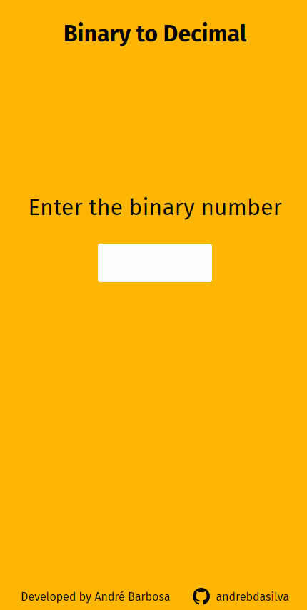

# Bin2Dec

	<a href="./docs/readme_pt-br.md">In portuguese</a>  

This is a solution to the **[Bin2Dec](https://github.com/florinpop17/app-ideas/blob/master/Projects/1-Beginner/Bin2Dec-App.md)**.  
App Ideas challenge.

## Table of contents

- [Overview](#overview)
  - [The challenge](#the-challenge)  
  - [Bonus features](#bonus-features)  
  - [Screenshot](#screenshot)
- [Author](#author)
  - [Skills](#skills)
## Overview

### The challenge  

Users should be able to:  
- [x] User can enter up to 8 binary digits in one input field  
- [x] User must be notified if anything other than a 0 or 1 was entered  
- [x] User views the results in a single output field containing the decimal (base 10) equivalent of the binary number that was entered  

### Bonus features  
 - [ ] User can enter a variable number of binary digits  

### Screenshot

## Author

Developed by André Barbosa  
[Github](https://github.com/andrebdasilva)  
[Linkedin](https://www.linkedin.com/in/andr%C3%A9-barbosa-501502247)

### Skills

  